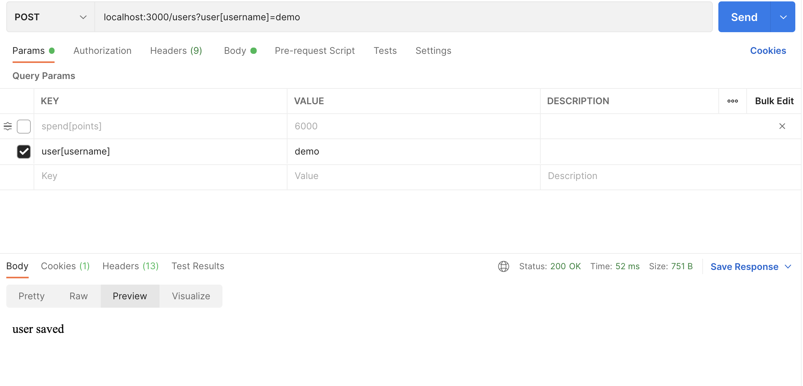
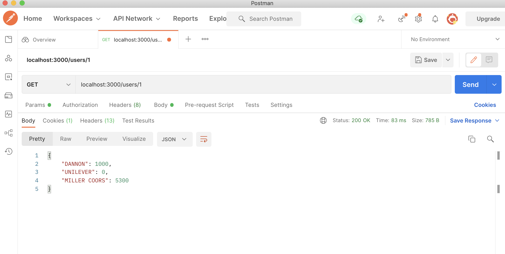
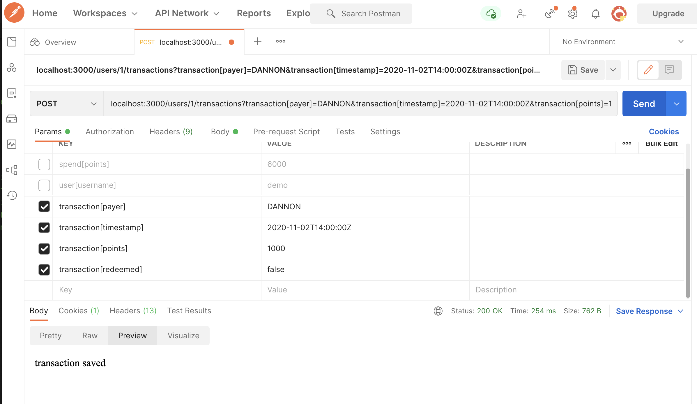
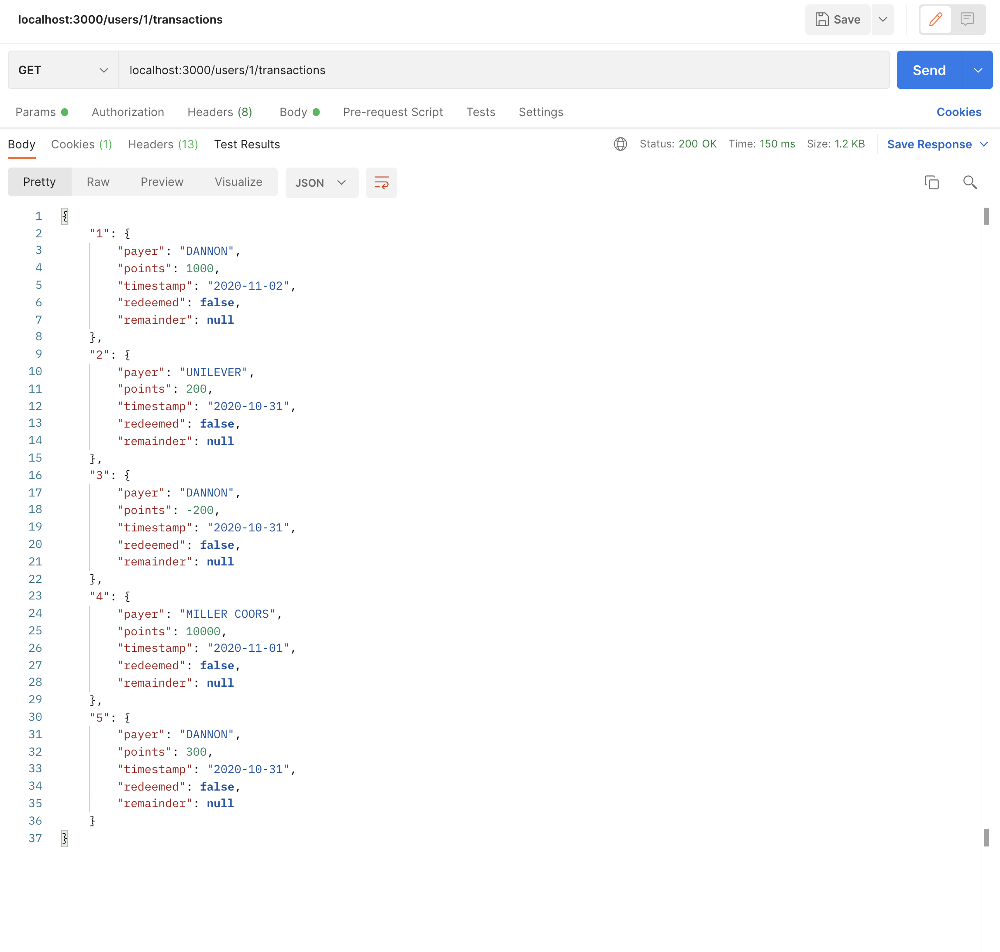
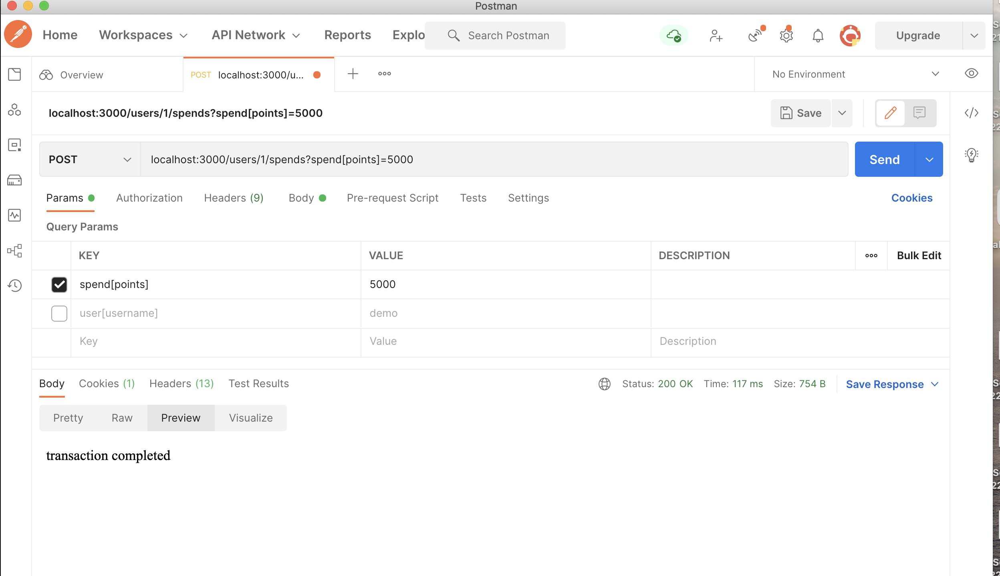
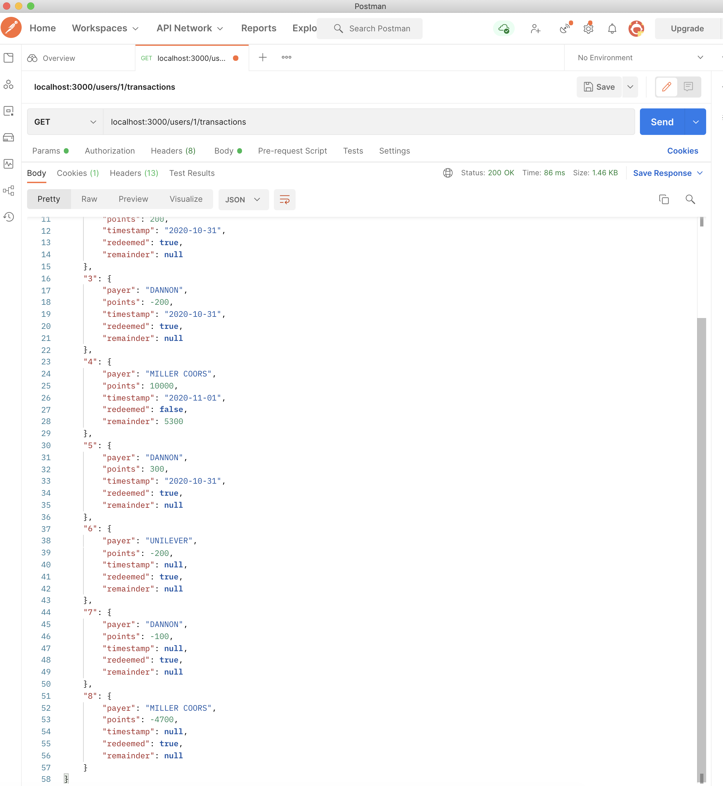

# README
## Description:
This repo should allow user to create an account, create transactions, and spend the points. There are 3 routes total(users, transactions, and spends). Transactions and spends are nested inside users to make it easier to indicate which user you want to add transaction or spend points on.

## Bonus:
Though the example shows only one call of spend. An edge case that I have considered for this design include when you want to call spend multiple times without having to repeat the process and continuously pick up from where the last spend was. A column in transaction called redeemed was added to indicate whether the transaction was redeemed or not. Redeemed turns true after the spend was used on that transaction. Remainder will only appear when the spend cannot full cover the transaction. Example, if you want to spend 300 and your oldest transaction is 500. After spend (300) was called, the remainder column would be updated to 200 and redeemed would still remain false until a full 500 is spent. 

## Backend Framework: Ruby on Rails
## Testing Tool: Postman
## Data: 
I have seeded a demo user and 5 given transactions from the prompt. Make sure to call rails db:setup.

## Routes: 
* users: [create, show]
  * create: POST HTTP request to create a user account.
    * 
  * show: GET HTTP request to show the balance of that specific user  
    * 

* transactions: [create, index]
  * create: POST HTTP request to create a transaction with specified payer, timestamp, and points 
    * 

  * index: GET HTTP request to list all the transactions that were made
    * 

* spends: [create ]
  * create: POST HTTP request to create a spend which will generate what kind of transactions will be made redeem from the previous transactions. Rule: The spend is applied to the oldest to newest transactions.
    * Spend is called 
      * 
    * Transactions of the corresponding amount and payer based of the timestamp were created
      * 
    * to see the balance, call show user
      * 

## Installation Instruction
* Install any code editor([VS Code](https://code.visualstudio.com))
* Install [Postman] (https://www.postman.com/downloads/) for testing purpose(can also use rails c to test)
* Full ruby/rails documentation on setting up env [Here](https://docs.google.com/document/d/1o6WpeYmk1FZfbmGIQaVEI0ihhBJOj6n5cukmlv4ilGg/edit?usp=sharing)